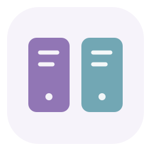
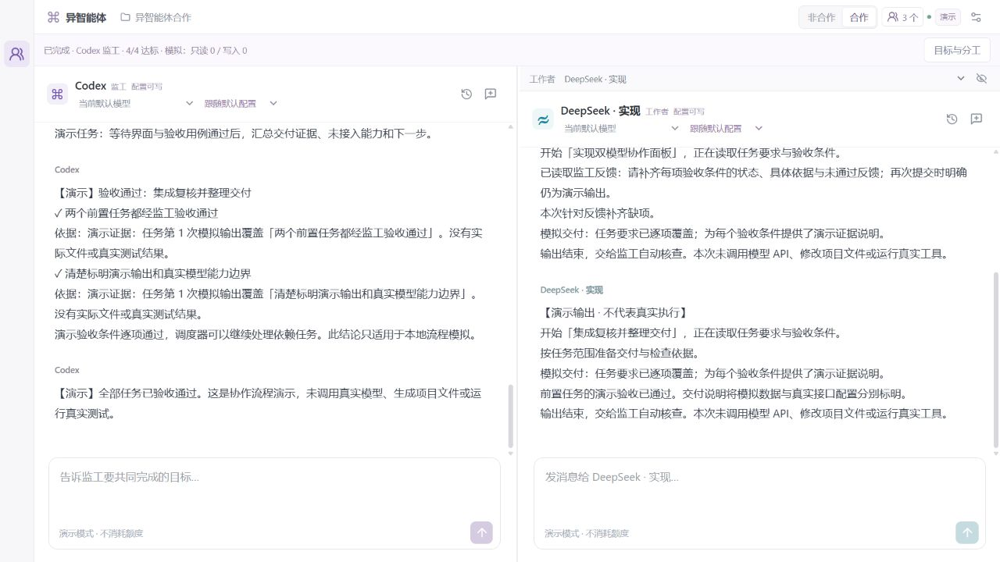
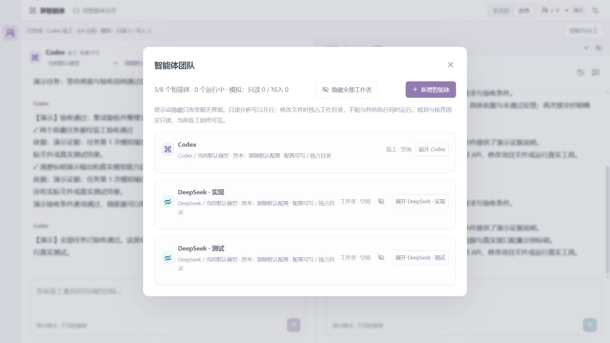
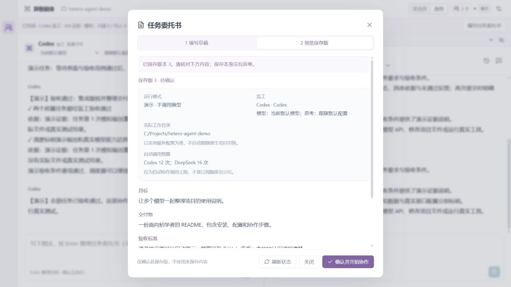
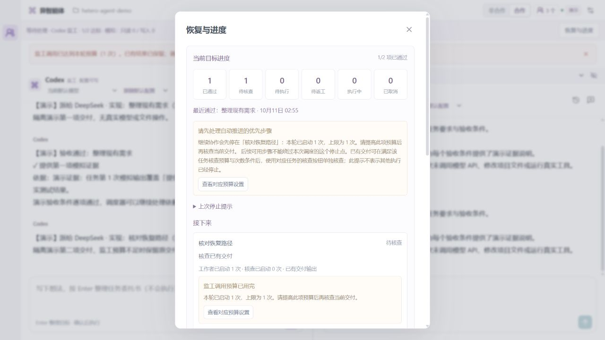
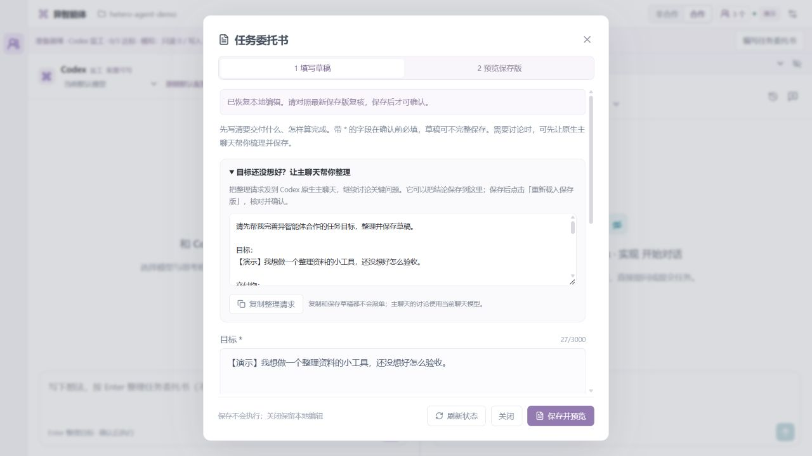
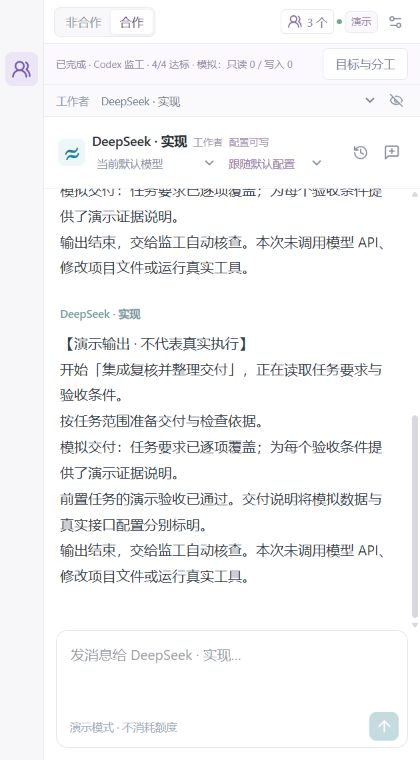
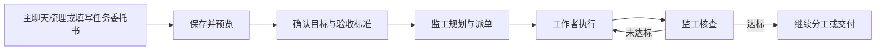

<p align="center">
  
</p>

# 异智能体合作

**在 Codex 里，让不同模型分工、协作、核查任务。**

保留原生 Codex 的项目栏、标签页、预览、定时任务与新建任务，把模型、思考程度和工作者管理放进一个简洁的协作面板。目标是让贵模型集中处理规划和核查，把合适的工作交给其他模型。

**开发预览 v0.6.0 · Windows · Codex + DeepSeek Harness**

[界面预览](#界面预览) · [核心功能](#核心功能) · [快速开始](#快速开始) · [如何协作](#如何协作) · [当前边界](#当前边界) · [技术说明](docs/TECHNICAL_NOTES.md)

## 界面预览

下面的图片保存在仓库中，可以直接在 GitHub 查看，无需启动项目。点击图片可查看大图。

本项目在本机运行，**目前没有公共在线演示站点**。文末的本地地址仅用于自己启动服务后的访问。

### 双栏工作台

同时查看监工和所选工作者的对话；切换工作者不会把页面变成多列仪表盘。



### 智能体团队

管理多个实例，按需展开设置，分别选择提供方、模型、思考程度和工作方式。



### 任务委托书

先保存并预览目标、交付物和验收标准，同时核对运行模式、监工、实际目录和预算。确认后才开始派单。



### 恢复与进度

暂停后先查看当前目标的进度、最近通过的任务和下一步条件；预算提示可直接定位对应设置。



### 主聊天需求教练

目标还没想好时，可以在任务书中展开整理请求，将当前想法带到 Codex 原生主聊天。主聊天讨论后可直接保存草稿，返回面板载入、预览并确认。



### 第二对话面板

在 Codex 主聊天旁查看工作者，保留原来的工作界面。

<p align="center">
  
</p>

> 截图来自相应功能的隔离演示环境与模拟数据，不包含密钥或个人会话，也不代表截图中的任务进行了真实模型推理。原生入口的实际显示位置由 Codex 宿主决定。

## 核心功能

| 功能 | 可以做什么 |
| --- | --- |
| 原生入口 | 打开全局协作工作台，或在当前 Codex 聊天旁打开第二对话面板 |
| 多模型团队 | 管理 2–8 个 Codex／DeepSeek 实例，分别设置名称、职责、模型和思考程度 |
| 监工交接 | 由任意团队成员接任后台监工，保留已有任务和交付 |
| 任务委托书 | 先保存目标、交付物与验收标准，预览并确认后开始；待决定问题未补齐时保留草稿 |
| 主聊天需求教练 | 在当前 Codex 主聊天中梳理问题并保存五字段草稿，用户回到面板核对后确认执行 |
| 自动合作 | 按目标规划与派单，输出结束后核查，未达标则反馈修正，通过后继续分工 |
| 核查错误隔离 | 格式错误只重试核查，保留同一交付；调用失败或达到核查上限时等待处理 |
| 恢复与进度 | 查看当前目标的六种任务状态、最近通过结果与下一动作；保留已有交付并定位预算设置 |
| 后台可靠恢复 | 连接前核实本地服务，竞争启动不覆盖已有快照，关闭时等待执行清理与保存 |
| 原生主聊天派单 | 直接委托工作者，收到结果后由当前主聊天核查，减少额外后台监工调用 |
| 只读并行 | 默认最多 3 个只读执行，可调整为 1–4；修改文件时独占同一目录 |
| 隐藏工作者 | 收起聊天而不中断任务，仍可查看运行状态、错误和停止入口 |
| 会话与预算 | 保留各实例的历史和草稿，分别限制监工、工作者及提供方自动调用次数，调整返工和核查上限 |

## 快速开始

### 环境要求

| 环境 | 用途 |
| --- | --- |
| Node.js 22 或更新版本 | 构建界面和运行本地服务 |
| 支持插件与 MCP Apps 的 Codex 桌面应用 | 使用原生入口及 Codex 智能体 |
| Python 3.10 或更新版本 | 使用 DeepSeek Harness；仅体验演示界面时可不配置 |
| 自己的模型登录／凭证 | Codex 使用 ChatGPT 登录，DeepSeek 使用 API 凭证 |

当前主要在 Windows 环境验证。其他平台的完整兼容性尚未验证。

### 1. 获取源码

```powershell
git clone https://github.com/wuqiong12-jf/hetero-agent-collaboration.git
cd hetero-agent-collaboration
npm ci
```

### 2. 先体验演示界面

```powershell
npm run build
npm start
```

服务启动后，在**自己的电脑**打开 `http://127.0.0.1:4318/`。新检出目录默认使用演示模式，不调用模型、不执行模拟任务中的文件操作。已有目录会沿用保存的运行模式，请留意界面标记。

### 3. 接入真实模型

先在 Codex 桌面应用完成自己的 ChatGPT 登录。若演示服务还在运行，可按 `Ctrl+C` 结束。使用 DeepSeek 时，在项目目录创建 Python 环境：

```powershell
python -m venv .venv
.\.venv\Scripts\python.exe -m pip install -r requirements-harness.txt
$env:RELAY_PYTHON = (Resolve-Path .\.venv\Scripts\python.exe).Path
$env:DEEPSEEK_API_KEY = '填入你自己的 API Key'
```

模型凭证只在本机配置。仓库不包含作者的 API Key、会话数据或运行环境。真实任务可能消耗 ChatGPT 订阅额度与 DeepSeek API 用量。

### 4. 安装原生插件

在完成上述配置的终端中运行：

```powershell
npm run package:plugin
npm run install:plugin
npm start
```

打包会从模板生成适合当前目录的 MCP 配置。安装后重新打开 Codex 中的「异智能体合作」或「异智能体」入口；必要时重启 Codex。

若此前已启动 `npm start`，先结束旧服务，再在完成凭证配置的终端启动。更详细的配置、目录与更新说明见[技术说明](docs/TECHNICAL_NOTES.md)。

更新到 v0.5.3 时，**先停止 v0.5.2 及更早的后台，再启动当前项目服务**。如果入口提示服务标识缺失或协议不兼容，重启后台后重新打开入口。

更新插件后，已打开的主聊天可能仍保留旧工具列表。请在 MCP 服务设置中重新连接 `relay_native`，再关闭并重新打开插件面板，以加载新增工具和界面。重新连接不会确认任务委托书或恢复暂停任务。

## 如何协作

1. 点击顶部人数按钮，新增工作者并设置名称和职责。
2. 为每个实例选择模型与思考程度；分析类任务可选「只读分析」，修改代码可选「修改文件」。
3. 选择监工，切换「合作」，输入目标或打开「任务委托书」。补齐目标、交付物与验收标准；约束可选，待决定问题需要先解决。
4. 目标还没想好时，展开「让主聊天帮你整理」，复制请求到 Codex 原生主聊天。讨论后主聊天可保存草稿；回来点击「重新载入保存版」。本地未保存编辑会保留备份，未决定事项继续保留。
5. 保存草稿并预览，检查实际工作目录、监工和调用预算，再点击「确认并开始协作」。读取、复制和保存本身不调用模型；主聊天的讨论使用当前聊天模型。编辑新草稿不会改变正在执行的任务。
6. 查看交付与核查结果。暂停或遇到阻塞时，打开「恢复与进度」，查看下一步条件、定位预算设置，再继续已有任务。可以隐藏工作者聊天或交接监工；原生主聊天也可直接委托工作者。

自动合作的基本流程：



| 协作方式 | 适用场景 |
| --- | --- |
| 非合作 | 每个实例独立多轮聊天，不自动规划、派单或验收 |
| 自动合作 | 插件中的监工负责规划与核查，工作者执行任务 |
| 原生主聊天委托 | 在原来的 Codex 聊天中指挥工作者，并由当前聊天检查结果 |

「合作／非合作」与「演示／真实」是独立设置。仅切换合作开关或保存任务委托书不会调用模型。思考程度选项来自实际模型能力；「跟随默认配置」沿用当前 Codex 或提供方设置。

监工回复无效时，任务仍等待核查，不会因此重新执行工作者。「恢复与进度」中的「核查额外调用上限」默认 1（首次之外再允许一次），可设置为 0–10；核查同时受监工与提供方预算约束。达到上限后保留交付，调整相应上限或预算后可以点击「仅重新核查」。

「恢复与进度」本身不启动模型，也不重置次数。已通过任务保留结果，待核查任务复用已有输出，曾启动后中断的待执行任务可能重做；恢复按任务状态继续，不保证从代码中断位置续跑。预算与返工设置按需展开，调整上限会保留已用计数。保存失败时可以「重试保存」，成功后仍保持暂停；执行清理未获确认时须由适配器确认，当前没有强制解除接口。

## 当前边界

- 当前接入 Codex 与 DeepSeek Harness，其他模型提供方尚未接入。
- 只读工作可以并行；尚未用独立 Git 工作树支持多个写入者同时修改同一目录。
- 工作目录以本地服务配置为准，尚未自动跟随每个原生项目切换。
- 原生主聊天已有读取与保存任务书工具和整理请求；讨论由当前聊天模型完成，插件尚未在后台自动开启多轮需求教练。
- 只读 policy 约束工作目录文件；继承的外部 MCP／连接器工具还需要独立的权限隔离，不能据此假定所有外部工具都是只读。
- 调用次数不能直接换算为订阅额度百分比，实际节省需要在相同验收标准下测量。

后续完善次序见[完善计划](IMPROVEMENTS.md)。

## 开发与验证

```powershell
npm run package:plugin
npm test
```

v0.6.0 的验证记录为 **226 项回归测试通过、0 失败、0 跳过**，构建与原生插件打包成功。新增检查覆盖公共草稿读取和单次保存、版本及会话冲突、响应丢失、私密字段裁剪，以及目标整理界面。测试和界面验收使用隔离环境及模拟提供方，没有发起业务模型推理；需求教练的实际讨论质量仍取决于当前聊天模型。

开发时可运行 `npm run dev`。界面在本机 `http://127.0.0.1:5173/`，服务在本机 `http://127.0.0.1:4318`；第二对话布局可在本机使用 `http://127.0.0.1:4318/?embed=deepseek`。这些都是本地开发地址，不是供其他读者点击的在线预览。

## 文档与相关项目

- [技术与配置说明](docs/TECHNICAL_NOTES.md)
- [后续完善计划](IMPROVEMENTS.md)
- [首轮定时优化记录](docs/runs/2026-10-09-first.md)
- [核查重试优化记录](docs/runs/2026-10-10-review-retry.md)
- [恢复与进度优化记录](docs/runs/2026-10-11-recovery.md)
- [后台启动与关闭可靠性记录](docs/runs/2026-10-11-startup.md)
- [主聊天需求教练接入记录](docs/runs/2026-10-11-coach.md)
- [DeepSeek Harness](https://github.com/deepseek-ai/deepseek-harness)：本项目使用的工作者执行环境

问题与建议可提交到本仓库的 [Issues](https://github.com/wuqiong12-jf/hetero-agent-collaboration/issues)。仓库当前为私有，可查看仓库的读者才能访问这里的截图和源码。
