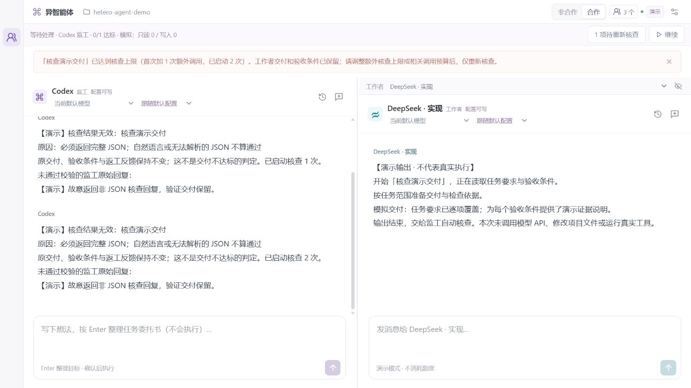

# 核查重试优化 · 2026-10-10

版本：0.5.1。目标是减少由于监工回复无效而产生的重复工作者调用。此轮于北京时间 2026-10-10 开始，在额度恢复后于 2026-10-11 完成收尾。

## 问题与修正

原来监工 JSON 无法解析、缺少逐项证据或补充分工无效时，调度器会合成 `rejected`，把条件标为 failed 并重新派工作者执行。这个分支把核查本身的失败混成了交付不达标。

现在无效核查保留原交付、验收条件和证据、真正的返工反馈以及工作者尝试次数，任务继续等待核查。在次数与预算范围内只重新核查；有效且有证据的拒绝仍走正常返工。

实现参考了 LangGraph [按节点选择重试策略并限制尝试数](https://github.com/langchain-ai/langgraph/blob/main/libs/langgraph/langgraph/pregel/_retry.py) 的组织思路，仍沿用本项目调度器，没有复制源码或新增依赖。

## 有界核查

- 每份交付默认最多两次核查：首次加一次额外调用。额外次数可设置 0–10。
- 次数在成功预留核查调用时增加，预算未能预留时不增加。
- 被暂停或交接取消的核查也计数；暂停、继续、模式切换和恢复均不清次数。
- 达到独立上限或既有监工、提供方预算时停止，保留未验收输出。
- 只有真正开始新的工作者尝试时才清本份交付的核查次数。
- 传输错误保留交付并等待用户检查渠道；格式错误可以在限额内自动重核查。

界面保持两栏，只在有核查错误时显示待处理入口。协作设置显示核查次数、诊断、「仅重新核查」及独立上限。

## 验证结果

调度原有 46 项及新增 7 项专项测试已通过，验证同一交付在无效核查后可被有效验收、下游等待、精确次数上限、既有预算、传输失败、取消与交接后重启、有效拒绝的正常返工以及旧快照默认值。

- 完整回归：127 项通过、0 项失败、0 项跳过。记录在本机 `artifacts/0.5.1-tests.log`，不上传运行日志。
- 最终 TypeScript、Vite 与原生插件打包成功。后续改动只整理文档，没有重复已经通过的测试。
- 隔离界面实测：两次无效核查后，任务停止并保留交付，工作者尝试仍为 1，核查次数为 2/2。
- 将额外核查上限从 1 改为 2 后，点击「仅重新核查」，同一交付通过验收：工作者调用 1 次、监工调用 3 次、工作者尝试 1、核查次数 3。此记录是流程模拟，不能换算为真实额度节省比例。
- 420 × 760 窄侧栏无水平溢出；次数字段最小值 0、最大值 10，到顶按钮禁用正确。
- 所有回归与演示都使用假提供方，没有发起软件的真实模型推理调用。

## 安装核验

安装步骤曾因自动审批复核额度不足未执行；查询确认额度恢复后，沿原审批路径继续，没有绕过复核或兑换额度。

- `npm run install:plugin` 成功，认证及已有权限保持原配置。
- 原生 UI 缓存版本为 0.5.1；MCP 显示 connected，图标可用，资源为 `ui://relay/v0.5.1/workspace` 和 `ui://relay/v0.5.1/panel`。
- 实际后台版本为 0.5.1，当前任务暂停、活动执行与清理屏障均为 0。保留该状态，没有自动恢复真实任务。
- 工作区其他文件保持不变，提交范围只包含本轮代码、说明与模拟截图。

## 后续范围

这一轮修复核查错误导致的重复执行。外部 MCP／连接器的只读工具隔离与自动多轮需求教练仍需独立完善，记录在完善计划中。
